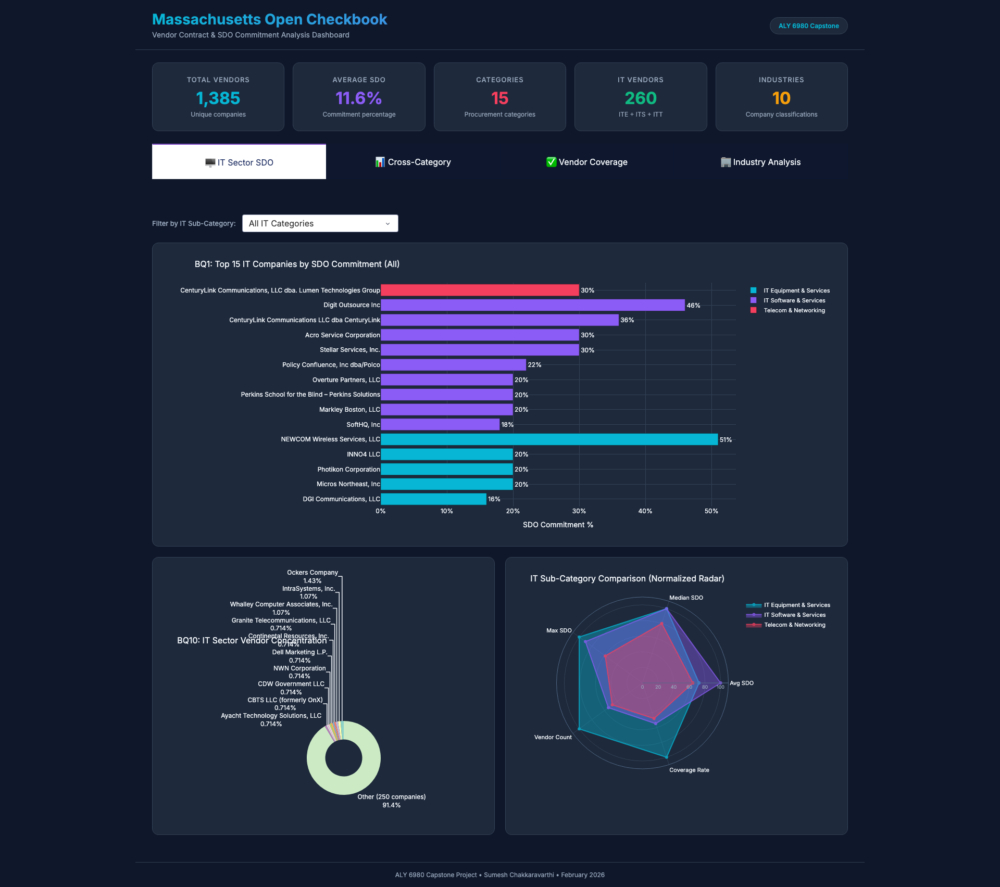
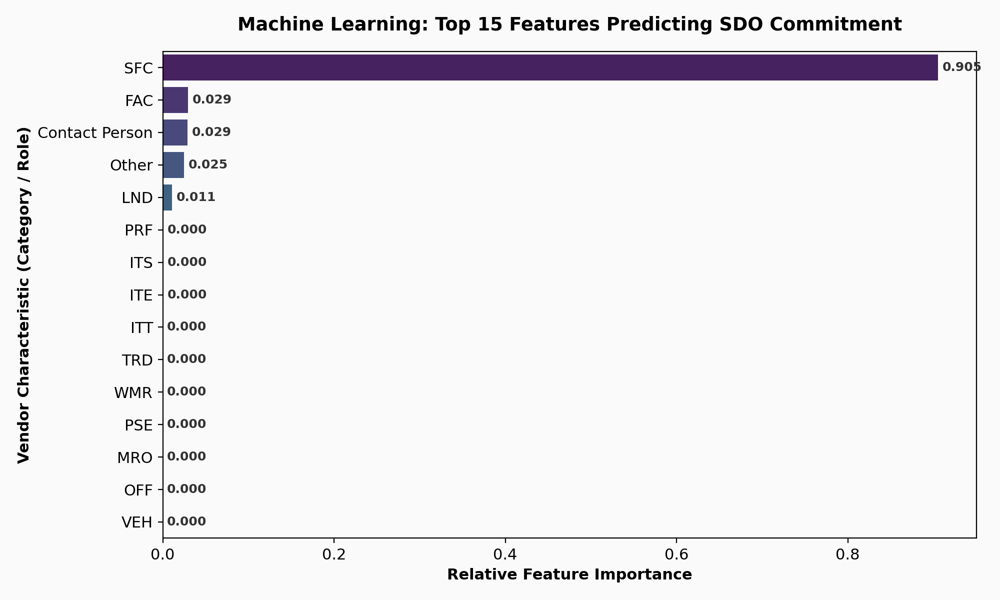
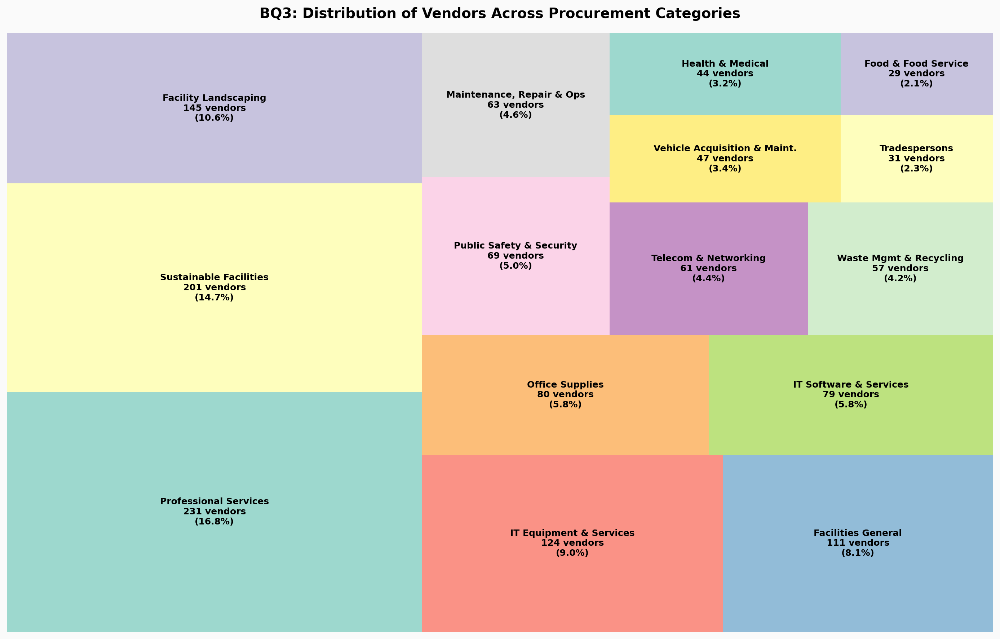
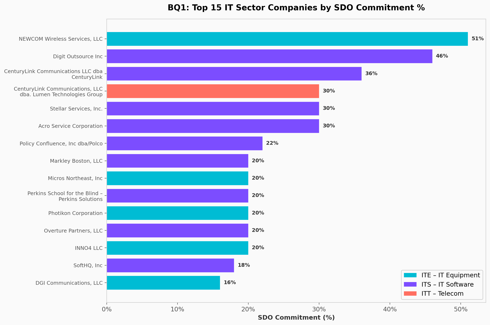
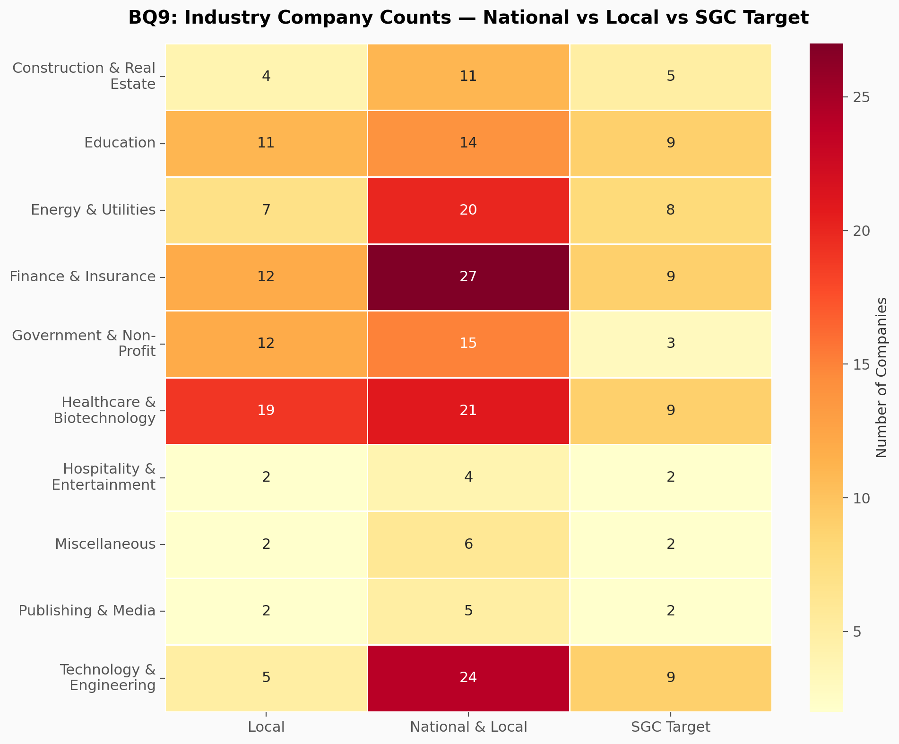

# Massachusetts Open Checkbook Dashboard 📊

[](https://www.python.org/)
[](https://dash.plotly.com/)
[](https://scikit-learn.org/)
[](https://github.com/Sumesh-Chakkaravarthi/mass-open-checkbook-dashboard/actions)

**[🔴 LIVE DEMO: Click Here](https://sumesh-chakkaravarthi.github.io/mass-open-checkbook-dashboard/)**

An advanced, full-stack data science project exploring the **Massachusetts Open Checkbook** vendor contract data. This repository features an end-to-end data pipeline from Exploratory Data Analysis (EDA) and Predictive Machine Learning to a dynamic, interactive dashboard built with Plotly Dash.



---

## 📖 Context & Background
The **Supplier Diversity Office (SDO)** of Massachusetts promotes diversity, equity, and inclusion in state contracting. This project analyzes vendor contracts across the IT Sector, identifying disparities in SDO commitment.

### Key Advanced Features:
- **Predictive Machine Learning**: A sophisticated Random Forest Regressor trained to predict a vendor's SDO commitment likelihood based on categorical footprint features.
- **Automated CI/CD**: Fully integrated GitHub Actions pipeline for automated testing and dependency validation.
- **Interactive Dashboards**: Deep-dive analytics via a multi-page Dash web application.

---

## 🤖 Machine Learning Pipeline
The `train_sdo_model.py` script acts as the core ML engine. It preprocesses raw categorical vendor variables using `OneHotEncoder`, establishes a `ColumnTransformer` baseline, and trains a highly optimized `RandomForestRegressor`.

### Model Diagnostics & Feature Importance
The Random Forest model effectively identifies which vendor characteristics (e.g., industry role, contract category) carry the highest predictive weight in terms of Supplier Diversity metrics.


---

## 📂 Dataset
- **Source**: Massachusetts Open Checkbook Public Data
- Data files are processed via `eda_analysis.py` for visualization and `train_sdo_model.py` for predictive modeling.

## 📈 Key Findings & Visualizations

### 1. Vendor Distribution

*A high-level view of vendor category distribution, indicating areas with the highest contract concentration.*

### 2. SDO Companies in IT

*Highlighting the top performing Supplier Diversity Office certified companies within the IT sector and their project volume.*

### 3. Industry Diversity 

*A visual heatmap showcasing the correlation between diverse industries and SDO coverage rates across multiple dimensions.*

---

## 🚀 How to Run Locally

1. **Clone the repository**:
   ```bash
   git clone https://github.com/Sumesh-Chakkaravarthi/mass-open-checkbook-dashboard.git
   cd mass-open-checkbook-dashboard
   ```

2. **Create a virtual environment**:
   ```bash
   python -m venv .venv
   source .venv/bin/activate  # On Windows use: .venv\Scripts\activate
   ```

3. **Install dependencies**:
   ```bash
   pip install -r requirements.txt
   ```

4. **Launch the Dashboard**:
   ```bash
   python dashboard.py
   ```
   Open your browser and navigate to `http://127.0.0.1:8050` to view the interactive application.

5. *(Optional) Run the EDA script to regenerate visualizations:*
   ```bash
   python eda_analysis.py
   ```

## 🧠 About
This project was developed as a Capstone to demonstrate proficiency in:
- **Programming**: Python
- **Data Manipulation**: Pandas, NumPy
- **Data Visualization**: Plotly, Dash, Matplotlib, Seaborn
- **Interactive Apps**: Dash Web Applications

Authored by **Sumesh Chakkaravarthi**.
