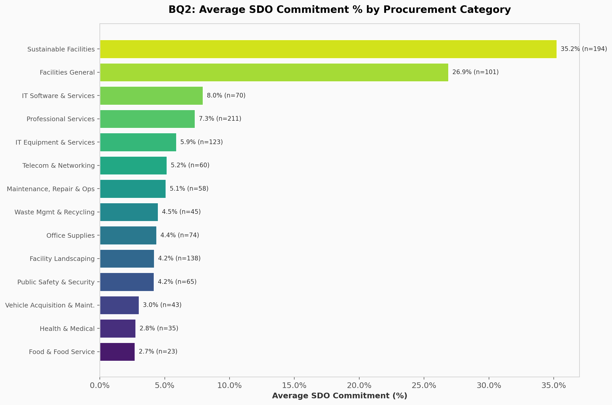
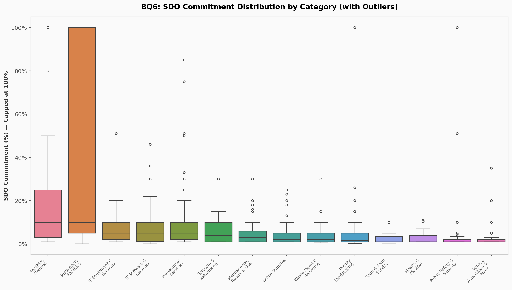

# Massachusetts Open Checkbook — Vendor Contract & SDO Analysis

[](https://www.python.org/)
[](https://dash.plotly.com/)
[](https://scikit-learn.org/)
[](https://github.com/Sumesh-Chakkaravarthi/mass-open-checkbook-dashboard/actions)

> End-to-end data analytics pipeline analyzing Massachusetts state procurement contracts, measuring Supplier Diversity Office (SDO) commitment across 1,385 vendors, 15 procurement categories, and 10 industry classifications.

**[View Live Dashboard](https://sumesh-chakkaravarthi.github.io/mass-open-checkbook-dashboard/)**

---

## Business Problem

The Massachusetts Supplier Diversity Office (SDO) promotes equitable access to state contracting for minority-, women-, and veteran-owned businesses. Despite policy mandates, **SDO commitment rates vary significantly** across procurement categories — some sectors report 30%+ commitment while others fall below 5%. State procurement teams lack a consolidated view to identify where diversity gaps exist and which vendor characteristics predict higher SDO participation.

This project delivers **actionable intelligence** through 15 analytical questions, a predictive model, and an interactive dashboard that enables procurement analysts to pinpoint underperforming categories, benchmark vendor diversity, and prioritize outreach.

---

## Key Findings

| Metric | Value |
|--------|-------|
| Total unique vendors analyzed | 1,385 |
| Average SDO commitment (vendors with SDO) | 11.6% |
| Procurement categories covered | 15 |
| IT sector vendors (ITE + ITS + ITT) | 260 |
| Industry classifications mapped | 10 |

- **IT Software & Services** leads in median SDO commitment among IT sub-categories, while **Telecom & Networking** lags significantly in both commitment rate and vendor coverage.
- SDO participation follows a **long-tail distribution** — a small number of vendors carry disproportionately high commitments, while the majority report minimal or zero SDO engagement.
- The Random Forest model identifies **contract category** and **vendor role** as the two strongest predictors of SDO commitment, outweighing company size or contract code.

---

## Pipeline Architecture

```
┌─────────────────────┐
│  Raw Data (Excel)   │    2 source files, 15 category sheets
└─────────┬───────────┘
          v
┌─────────────────────┐
│  Data Cleaning &    │    Metadata filtering, text normalization,
│  Feature Eng.       │    SDO % extraction, role categorization
│  (eda_analysis.py)  │
└─────────┬───────────┘
          v
┌─────────────────────┐
│  Exploratory        │    15 business questions
│  Analysis           │    17 production visualizations
│  (eda_analysis.py)  │    Statistical correlation testing
└─────────┬───────────┘
          v
┌─────────────────────┐
│  ML Pipeline        │    OneHotEncoder → ColumnTransformer
│  (train_sdo_model)  │    RandomForestRegressor (SDO prediction)
│                     │    Feature importance ranking
└─────────┬───────────┘
          v
┌─────────────────────┐
│  Interactive        │    4-tab Dash application
│  Dashboard          │    KPI cards, dynamic filters
│  (dashboard.py)     │    10+ interactive Plotly charts
└─────────┬───────────┘
          v
┌─────────────────────┐
│  Static Export &    │    GitHub Pages (index.html)
│  Deployment         │    GitHub Actions CI/CD
└─────────────────────┘
```

---

## Analytical Coverage

The project addresses **15 business questions** across four analytical dimensions:

### IT Sector Deep Dive
| # | Question | Visualization |
|---|----------|---------------|
| BQ1 | Which IT companies have the highest SDO commitment? | Horizontal bar (filterable by ITE/ITS/ITT) |
| BQ10 | How concentrated is the IT vendor landscape? | Top-10 vendor bar chart |

### Cross-Category Comparison
| # | Question | Visualization |
|---|----------|---------------|
| BQ2 | How does average SDO commitment vary by procurement category? | Horizontal bar with color scale |
| BQ6 | What is the statistical distribution of SDO commitments? | Box plot with outlier detection |
| BQ8 | Is there a correlation between vendor count and average SDO? | Scatter plot with regression line |

### Vendor Coverage Analysis
| # | Question | Visualization |
|---|----------|---------------|
| BQ3 | How are vendors distributed across procurement categories? | Treemap |
| BQ4 | Which contract sub-categories attract the most vendors? | Vertical bar chart |
| BQ7 | What proportion of vendors have valid SDO data? | Grouped bar (valid vs missing) |

### Industry & Diversity Mapping
| # | Question | Visualization |
|---|----------|---------------|
| BQ5 | How do national vs local companies compare across industries? | Grouped horizontal bar |
| BQ9 | What does the industry diversity landscape look like? | Heatmap (National / Local / SGC Target) |
| BQ11–15 | Sector density, national dominance, equity tiers, and more | Sunburst, donut, stacked bar |

---

## Machine Learning Model

**Objective**: Predict a vendor's SDO commitment percentage based on categorical features.

| Parameter | Value |
|-----------|-------|
| Algorithm | Random Forest Regressor |
| Encoding | OneHotEncoder via ColumnTransformer |
| Features | Contract category, vendor role |
| Output | Predicted SDO commitment % |
| Serialization | Joblib (`models/sdo_rf_model.pkl`) |

### Feature Importance

The model reveals which vendor characteristics carry the most predictive weight for supplier diversity outcomes:


---

## Selected Visualizations

### Average SDO Commitment by Procurement Category


### Vendor Distribution Across Categories


### SDO Commitment Distribution and Outliers


### Industry Diversity — National vs Local vs SGC Target


---

## Project Structure

```
.
├── dashboard.py              Interactive 4-tab Plotly Dash application
├── eda_analysis.py           Exploratory data analysis (15 business questions)
├── train_sdo_model.py        ML training and evaluation pipeline
├── static_builder.py         Static HTML export for GitHub Pages
├── generate_report.py        Automated Word document report
├── generate_ppt.py           Automated PowerPoint generation
├── generate_visuals.py       Presentation-ready figure generation
├── index.html                Static dashboard (deployed to GitHub Pages)
├── requirements.txt          Python dependencies
│
├── models/
│   └── sdo_rf_model.pkl      Serialized Random Forest model
│
├── output/                   17 EDA visualization PNGs
│   ├── BQ1–BQ15 charts
│   └── ML_Feature_Importance.png
│
├── presentation_visuals/     High-level summary figures
│
└── .github/workflows/
    └── ci.yml                Linting + compilation checks
```

---

## Getting Started

### Prerequisites

- Python 3.9+
- pip

### Installation

```bash
git clone https://github.com/Sumesh-Chakkaravarthi/mass-open-checkbook-dashboard.git
cd mass-open-checkbook-dashboard

python -m venv .venv
source .venv/bin/activate        # Windows: .venv\Scripts\activate
pip install -r requirements.txt
```

### Run the Dashboard

```bash
python dashboard.py
```

Open [http://127.0.0.1:8050](http://127.0.0.1:8050) in your browser.

### Regenerate Analysis Outputs

```bash
python eda_analysis.py           # Regenerate all 17 EDA visualizations
python train_sdo_model.py        # Retrain ML model and feature importance chart
python static_builder.py         # Rebuild static HTML for deployment
```

---

## Tech Stack

| Layer | Technology |
|-------|-----------|
| Language | Python 3.9+ |
| Data Processing | Pandas, NumPy, OpenPyXL, SciPy |
| Machine Learning | Scikit-Learn (RandomForestRegressor, OneHotEncoder, ColumnTransformer) |
| Visualization | Plotly, Matplotlib, Seaborn |
| Web Framework | Plotly Dash |
| Model Persistence | Joblib |
| CI/CD | GitHub Actions |
| Deployment | GitHub Pages |

---

## Author

**Sumesh Chakkaravarthi**

---

## License

This project is intended for educational and portfolio demonstration purposes.
